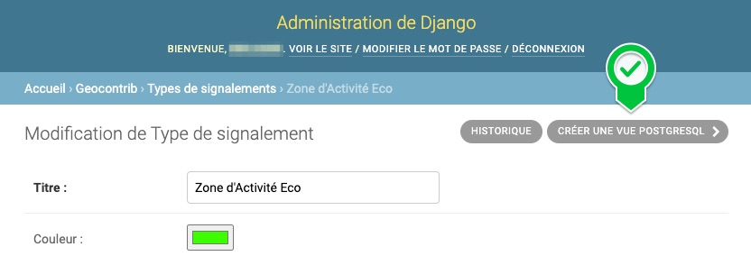
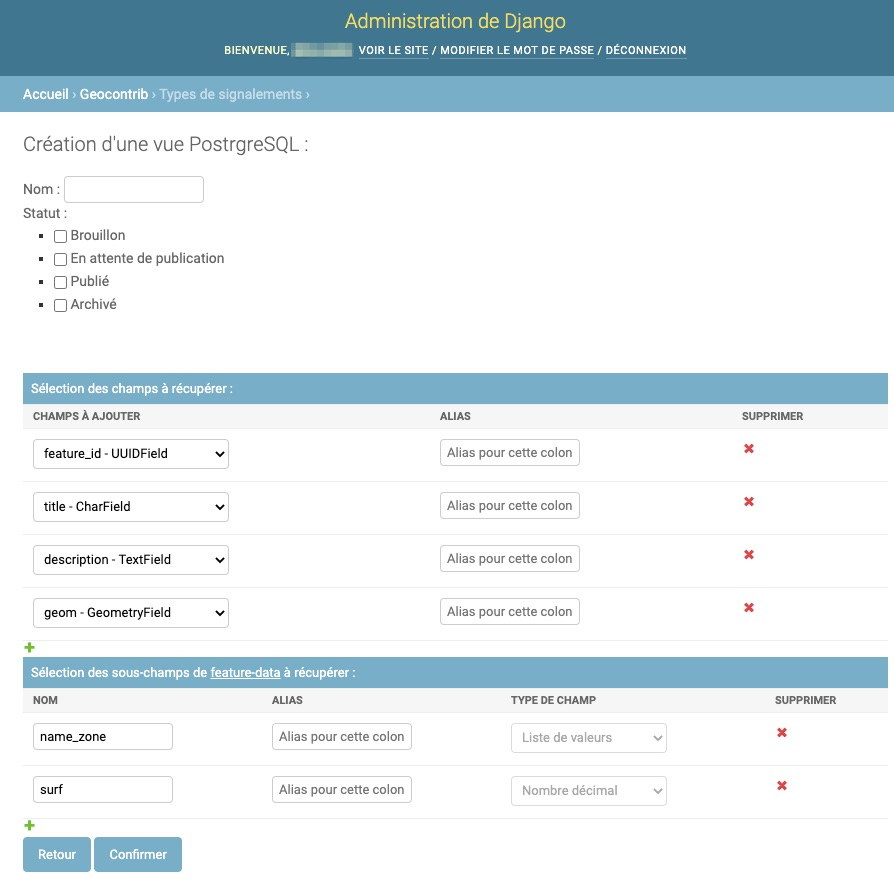

# Rendre accessibles des signalements à des outils externes

## Création d'une vue dans PostgreSQL

L'intégralité des signalements sont stockés dans PostgreSQL dans une table unique : `geocontrib_feature`. 
Les champs spécifiques à chaque type de signalements sont stockés dans une colonne de type JSON : `feature_data`.
Afin de rendre accessibles certains signalements en consultation à des outils externes (MapServer et GeoServer par exemple), il est recommandé de créer une vue spécifique à chaque besoin.

L'exemple suivant illustre la création d'une vue pour un type de signalements dont les champs spécifiques sont `age`, `taille` et `espece`. Les deux premiers sont des nombres entiers et le dernier une chaîne de caractères libre.

```CREATE OR REPLACE VIEW public.arbres AS
    SELECT geocontrib_feature.feature_id AS id,
        geocontrib_feature.geom,
        geocontrib_feature.title,
        geocontrib_feature.description,
        (geocontrib_feature.feature_data ->> 'age'::text)::integer AS age,
        (geocontrib_feature.feature_data ->> 'taille'::text)::integer AS taille,
        geocontrib_feature.feature_data ->> 'espece'::text AS espece
    FROM geocontrib_feature
    WHERE geocontrib_feature.feature_type_id = 1 
        AND geocontrib_feature.project_id = 1
        AND geocontrib_feature.status::text = 'published'::text;
​
    ALTER TABLE public.arbres
        OWNER TO geocontrib;
```

Cette vue filtre les signalements par rapport à :
* leur projet : `geocontrib_feature.project_id = 1` ;
* à leur type de signalement : `geocontrib_feature.feature_type_id = 1` ;
* à leur état de publication : `geocontrib_feature.status = ‘published’`.

La création d'une telle vue est facilitée par la présence d'une fonction dédiée accessible via le bouton suivant dans l'interface d'administration de Django (dans la page consacrée au type de signalement pour lequel vous voulez créer une vue) :


Ce bouton donne accès au formulaire suivant :


Il est composé de quatre parties :
* La saisie du nom de la vue à créer ;
* Le filtre sur le statut des signalements à intégrer à la vue SQL ;
* Les champs standards des signalements à intégrer à la vue SQL. Par défaut, une pré-sélection de champs est proposée à l'utilisateur mais ce dernier peut en ajouter d'autres avec le petit bouton en forme de + situé sous cette liste.
* Les champs spécifiques du type de signalement à intégrer à la vue. Par défaut, l'ensemble des champs spécifiques du type de signalement sont pré-sélectionnés mais l'utilisateur peut en retirer grâce aux croix rouges disponibles sur la dernière colonne du tableau.

Pour les champs standards ou spécifiques du type de signalement, l'utilisateur a la possibilité de définir des alias (dans la colonne Alias).


## API

Une API pourrait à terme faciliter l'accès aux données à des outils tiers.
